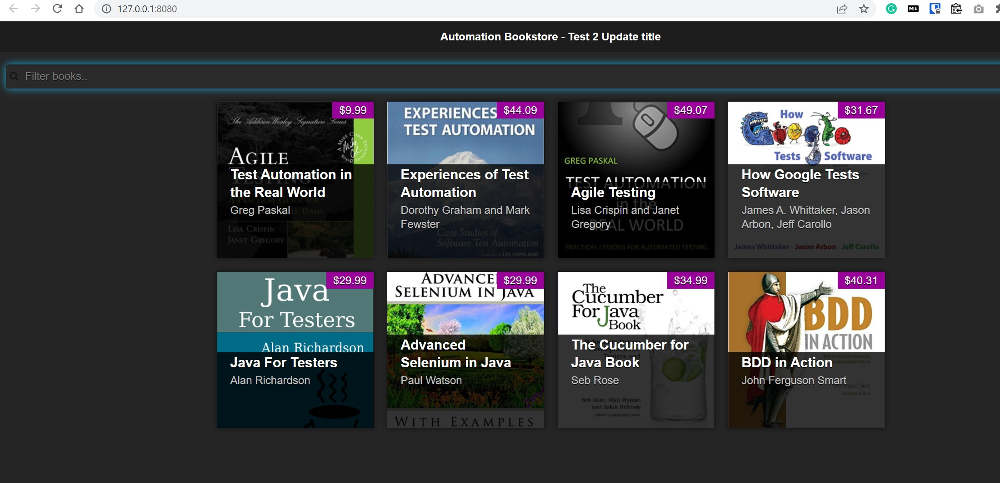
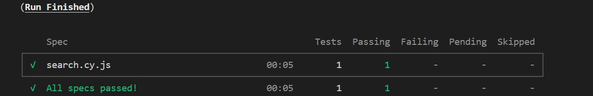
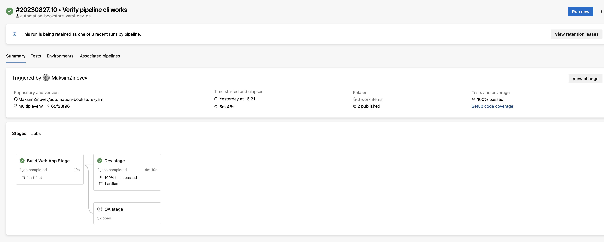

## About

This is a repo with a sample project that I used to practice using Azure DevOps and Azure Pipelines for test automation. Repo is forked from [bushralam/automation-bookstore at chapter-2](https://github.com/bushralam/automation-bookstore/tree/chapter-2)

Site is deployed at <https://automationbookstore.dev> (<https://mzinbookstore-linux.azurewebsites.net>) or can be downloaded and used locally.

## Installation

```bash
git clone https://github.com/MaksimZinovev/automation-bookstore-yaml.git
```

## Usage

To run tests locally
Install [live-server - npm](https://www.npmjs.com/package/live-server)

```bash
npm install live-server -g  
```

2. Check in your browser <http://127.0.0.1:8080/>. Website should be accessible
3. Install Cypress

```bash
cd e2e-tests
npm init -y
npm install cypress
npx cypress open

```

Follow prompts and complete setup for Chrome.
Run `search.cy.js` in Cypress app to check if it is working.

3. Run the website

```bash
cd automation-bookstore-yaml
live-server
```

4. Run cypress tests from CLI

```bash
npm test
```

5. Run cypress specs in UI mode

```shell
npx cypress open
```

  




